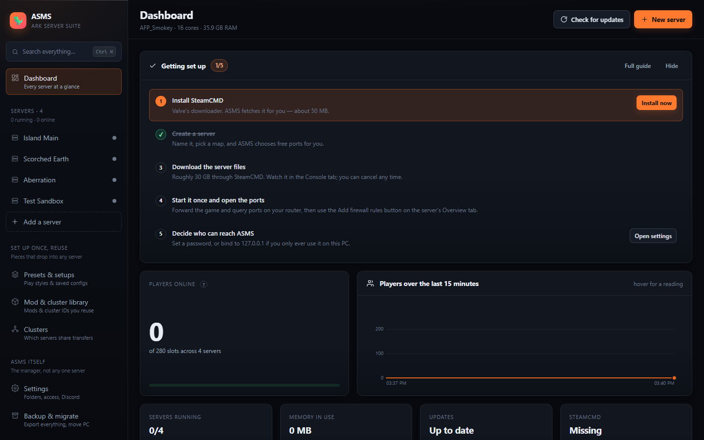
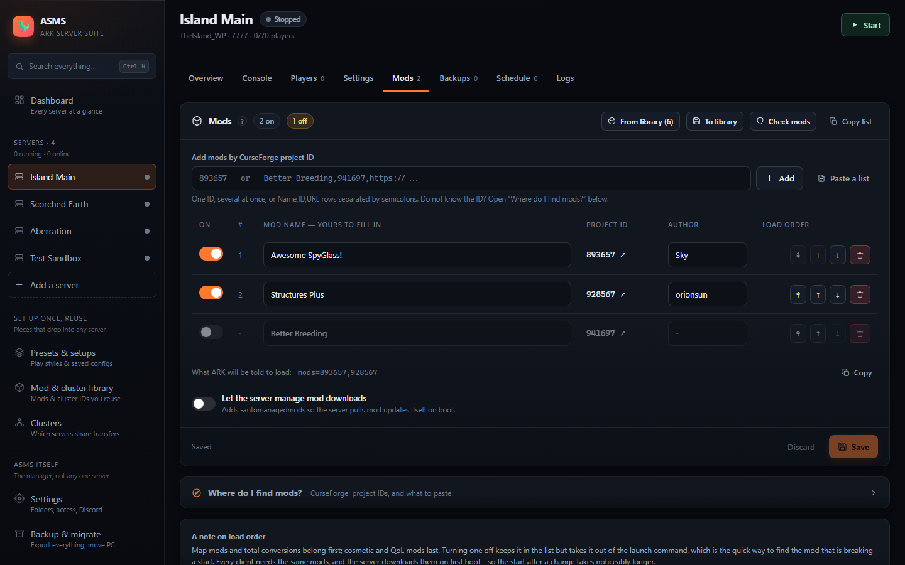
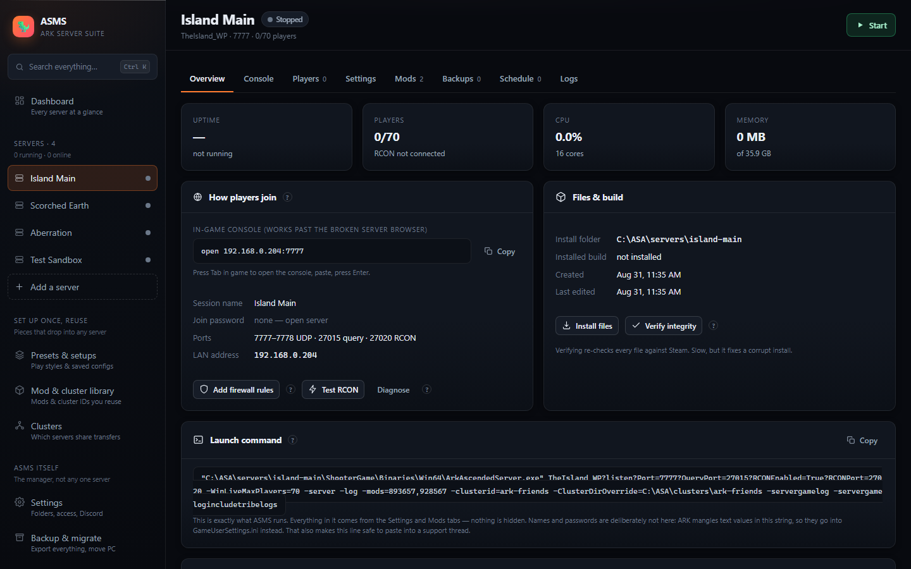
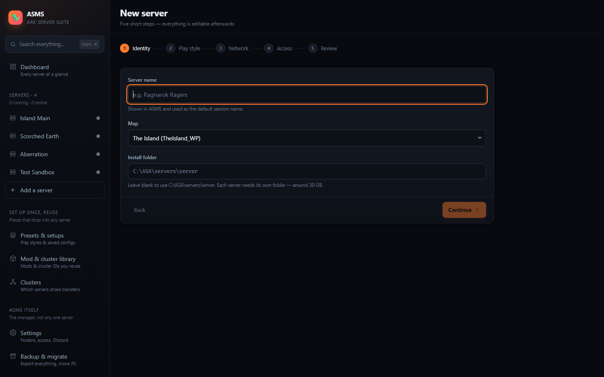
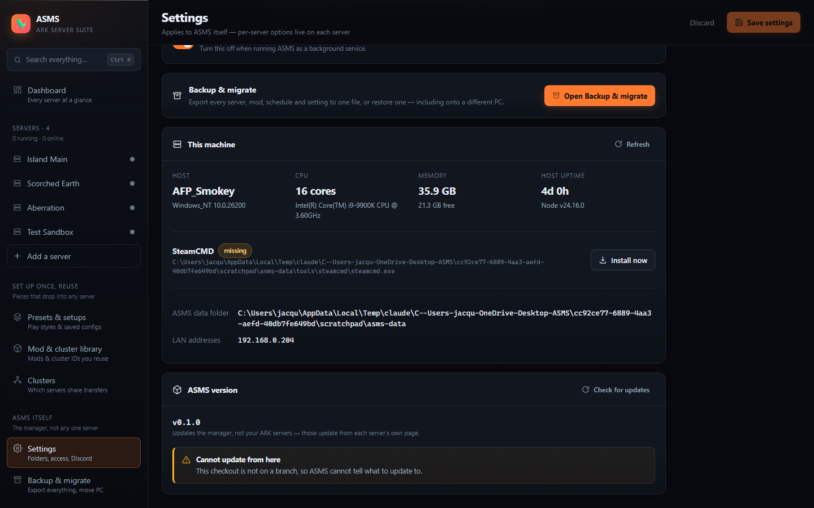

<div align="center">

# ASMS — Ark Server Management Suite

**A self-hosted manager for ARK: Survival Ascended dedicated servers.**

It runs on the machine hosting your servers and gives you a fast, dark, keyboard-friendly web
dashboard — on that PC, on your laptop, or on your phone while you are on the couch.

No installer, no licence key, no paid tier. It is your machine and your files.

[](https://github.com/OWNER/REPO/actions/workflows/ci.yml)
[](LICENSE)
[](https://nodejs.org)
[](#running-in-docker)

[Quick start](#quick-start) · [What it does](#what-it-does) · [Docker](#running-in-docker) ·
[Troubleshooting](#troubleshooting) · [Contributing](CONTRIBUTING.md) ·
[Changelog](CHANGELOG.md) · [Security](SECURITY.md)



</div>

---

## Why this exists

Every ARK server manager I tried got in the way. The closest one I liked was a closed-source
Windows MSI with a paid tier — so this is the version I wanted: open, free, and reachable from a
phone, which is the one thing the MSI could not do.

The things it does differently:

- **A web UI, so the cluster is manageable from the couch.** Same dashboard on the PC, a laptop
  and a phone on the LAN.
- **Nothing is hidden.** The full launch command is always on screen, ready to paste into a
  support thread.
- **Everything long-running is cancellable**, with a progress bar and a countdown that lands on
  the scheduled time rather than a minute after it.
- **No native dependencies.** `npm install` never needs a C compiler on a gaming PC — the RCON
  client, INI parser, cron engine and SteamCMD driver are all hand-written.

---

## Screenshots

<table>
<tr>
<td width="50%">

<b>Mods</b><br>
A real load order — name, author, project ID and link per mod, reorderable, each switchable off
without losing it. The quickest way to find the mod breaking a start.
</td>
<td width="50%">

<b>Server overview</b><br>
How players join, ports, firewall rules, RCON test — and the exact launch command ASMS will run.
</td>
</tr>
<tr>
<td width="50%">

<b>New server</b><br>
Five short steps. Free ports are picked for you, conflicts are flagged, and an install folder too
deep for ARK to unpack mods into is refused before you get to step two.
</td>
<td width="50%">

<b>Updating ASMS</b><br>
<b>Settings → ASMS version</b> checks this repository for newer commits, shows what is waiting,
and pulls, reinstalls and rebuilds in place.
</td>
</tr>
</table>

---

## Quick start

1. Install [Node.js](https://nodejs.org) 20 or newer.
2. Double-click **`start.cmd`**.
   First run installs dependencies and builds the UI (about a minute), then opens
   <http://localhost:8787>.
3. Click **Install SteamCMD** on the dashboard when prompted.
4. Click **New server**, walk the four steps, and let it download the server files.

The dashboard shows a checklist that ticks itself off as you go, and there is a full
**Setup guide** in the sidebar covering ports, firewall, mods, backups and what to do when
something breaks. Lost? Press **Ctrl K** anywhere.

From a terminal instead:

```bash
npm install && npm run build && npm start
```

Leave the window open. Closing it stops ASMS — your ARK servers keep running, and ASMS reattaches
to them the next time it starts.

---

## What it does

**Finding anything**
- **Ctrl K** searches the whole app from one box: every server and every tab, all ~90 game settings,
  every launch flag and RCON command, your saved mods, setups and cluster IDs, every action, and
  each section of the setup guide. Choosing a setting opens that control on a server, not just the
  tab it lives on
- When nothing in ASMS matches, it offers the places that would know — a CurseForge search for what
  you typed, or the ARK Wiki
- Every long list has its own find box: servers, mods, backups, setups, settings sections, log lines

**Mods**
- **Where do I find mods?** on every screen that asks for a project ID — the steps, and links
  straight into CurseForge's ASA browse, popular, most-downloaded and map listings
- Typing a mod's *name* into an ID box offers to search CurseForge for it, rather than refusing
- A real load order: name, author, project ID and link per mod, reorderable, with each one
  switchable off without losing it — the quickest way to find the mod breaking a start
- Paste a whole list in `Name,ID,URL;Name,ID,URL` form, or just a run of IDs, and copy it back out
- Only the enabled ones reach `-mods=`, which is shown in full
- A **library** of the mods you keep re-using, offered on every new server so a mod list is a few
  ticks rather than six project IDs retyped from a Discord thread

**Servers**
- Create servers with a five-step wizard that picks free ports for you and warns about conflicts
- Install, update and verify server files through SteamCMD with live progress you can cancel
- Start, stop, restart; graceful shutdown saves the world over RCON first
- Auto-restart after a crash, with a backoff that gives up after five crashes in 30 minutes
- Reattaches to servers still running if ASMS itself is restarted
- Auto-start after a reboot: marked servers come back on their own, one at a time
- Update-before-start, and background checking against Steam's public build id

**Configuration**
- Four one-click play styles — **Creative**, **Easy**, **Medium**, **Hard** — plus **Official** to
  reset to vanilla. Choosing one stages the changes so you can read them before saving
- ~90 curated settings with sliders, switches and plain-English explanations, grouped by Rates,
  Breeding, Players, Dinos, Structures, World, PvP/PvE, Tribes and Server
- Every setting shows the real INI key it writes, so you always know what changed
- A raw editor for `GameUserSettings.ini` and `Game.ini` for anything not curated
- 23 launch flags as labelled switches, grouped by what they affect — flyers in caves, crossplay,
  BattlEye, whitelist-only, anti-cheat and performance switches — plus a seasonal event picker and
  free-form args and URL parameters
- Save any server as a **setup**: its mods, settings and launch flags in one file you can re-apply
  elsewhere, keep as a checkpoint, or send to a friend
- The exact launch command is always visible and copyable — nothing is hidden

**Live operations**
- Console streaming the server's own stdout, SteamCMD output and RCON replies in one place
- RCON prompt with tab completion, command help and history
- Player list with kick, ban, whitelist and private messages
- Log viewer that tails ARK's log **and ASMS' own log**, with line numbers, severity colouring,
  per-level counts, search highlighting, follow mode, rotation handling and a download button
- Live charts of players over time, per-server sparklines, CPU and memory
- Command palette on Ctrl/Cmd-K to jump to any server, tab or action

**Keeping it alive**
- Scheduled restarts, backups, updates and RCON commands on a cron expression
- Countdowns that broadcast in game and land the restart *exactly* on the scheduled time — and can
  be called off mid-countdown
- Zipped backups of `SavedArks` plus both INIs, with retention, restore and download.
  Restoring takes a safety backup first, so it is itself reversible
- Optional Discord webhook for crashes, updates, restarts and backups

**Clusters**
- Group servers by cluster ID, see them together, start/stop/restart the whole cluster at once
- **Random cluster IDs** on a button, wherever an ID is typed. ARK matches clusters on this string
  and nothing else, so `1` is the same `1` a hundred other people used — ASMS warns about short,
  obvious IDs and rolls you one nobody else has

**Backup & migrate**
- **Export everything** to one file: every server with its ports, passwords, mods, launch flags and
  both INI files, plus schedules, backups, the library, saved setups and ASMS' own settings
- Import that file on another PC and you are back up — optionally re-pointing every install folder
  at the new machine's drive on the way in
- The restore dialog shows what is in the file and what it would land on before anything is touched

---

## How it compares

| | ASMS | Typical ASA managers |
|---|---|---|
| Interface | Web — reachable from any device on your network | Windows-only desktop window |
| Source | Open, readable, yours to change | Closed MSI |
| Cost | Free | Free tier plus paid features |
| Launch command | Shown in full, always | Hidden behind the UI |
| Dependencies | Node.js only — no native modules | Bundled runtime |
| Countdown restarts | Broadcast early so the restart lands on the hour, cancellable | Usually fires then warns |
| Play styles | Creative / Easy / Medium / Hard presets, staged for review before saving | Hand-edit each multiplier |
| Sharing a config | One file, passwords stripped, import by drag and drop | Copy INI files by hand |
| Deployment | Windows, or Docker on Linux | Windows app, or a separate CLI daemon |

---

## The library

**Mod & cluster library** in the sidebar is the shelf you build up over time. Nothing in it belongs
to a server —
it exists so that setting up the *next* one is a list of ticks.

**Saved mods.** Keep a mod's project ID, name, author and a note about what it does. Add them by
pasting IDs, or press **To library** on any server's Mods tab to keep the list you just curated —
the names and authors you filled in come across with it. On any other server, **From library** opens
a picker; mods already installed there are shown ticked and greyed, so you can see at a glance which
of your usuals are missing.

**Cluster IDs.** A cluster is just a string that every member server must spell identically — one
typo and you get two clusters that look like one. So every ID a server is given is recorded here
automatically, and you can add one up front before any server uses it. Each row shows which servers
are currently in it.

Every place that takes a cluster ID has a **Random** button beside it, and warns if you type
something like `1` or `test`: ARK has no other way of telling clusters apart, so a short obvious ID
is one other people's servers are plausibly using too. A generated ID looks like
`ark-y9c34jvegjkg` — twelve random characters, no `l`/`1`/`0`/`O` to misread when a friend retypes
it.

The new-server wizard asks about both:

- **"Connect to your other servers?"** — your clusters as buttons, with the number of servers already
  in each, plus *Standalone* and *New cluster*. No retyping.
- **"Add your usual mods?"** — with the mods it would add named, an **Add all** button and a
  **Pick some** picker. Names and authors travel into the new server, so its Mods tab is readable
  from the first minute.

Removing something from the library only forgets the shortcut. Servers already using that mod or
cluster ID are untouched.

---

## Presets and setups

**Presets & setups** in the sidebar is the shortcut past the wall of multipliers.

| Preset | What you get |
|---|---|
| 🎨 Creative | Everything unlocked, nothing decays, instant taming, huge build limits |
| 🌤️ Easy | ×5 harvest, ×10 taming, ×3 XP, fast breeding, PvE, no structure decay |
| ⚖️ Medium | ×3 harvest, ×5 taming, ×2 XP, breeding ×10. The friends-server sweet spot |
| 🔥 Hard | PvP, wild level cap 180, no offline raid protection, faster spoiling |
| 🎯 Official | Every curated setting back to vanilla |

Picking one from a server's **Settings → Game settings** tab *stages* the change: every affected row
is marked `edited` so you can read the diff and adjust before pressing Save. Nothing is written
until you do. Presets never touch mods, ports, passwords or launch flags.

A **setup** is the whole personality of a server in one file:

- its mods and their load order
- every curated game setting
- launch flags, extra arguments and player slots
- optionally the raw INI files, and your scheduled tasks

Save one from **Settings → Server & launch → Save as setup**, or from the Presets & setups page.
From there you can apply it to another server, download it, or drag someone else's file in to
import it. The new server wizard can start from one too.

**Setup files carry no secrets.** Passwords, ports, install paths, multihome addresses and session
names are stripped on the way out — including out of the raw INI text — so a setup is safe to post
in a Discord. On the way back in, every field is rebuilt and validated: unknown settings, implausible
mod IDs and invalid cron expressions are dropped rather than trusted.

---

## Backup and moving to another PC

**Backup & migrate** in the sidebar is one button in each direction. It is a top-level item
because it is what you reach for on a bad day — and it opens with the distinction that matters:
the file here is your *configuration*, while the zips that undo a bad night are per-server, on each
server's **Backups** tab.

**Export everything** saves a single `asms-backup-<host>-<date>.asms-archive.json` containing:

- every server — ports, passwords, mods, launch flags, extra args, cluster ID, auto-start policy
- both INI files of each server, verbatim, which is where the ~90 game settings actually live
- every scheduled task, and the list of backups ASMS knows about
- the mod and cluster library, every saved setup, and ASMS' own settings

**Restoring** takes the same file back. Drop it on the page and you get a dialog first: which
machine and day it came from, what is in it, and a row per server saying whether it would be added
or would replace one already here. From there you choose what to restore, whether to **Merge** with
what is here or **Replace everything**, and — for a different PC — whether to re-point install
folders at this machine's install root.

Two things worth knowing:

- **A backup file carries your passwords.** That is the point: a restore that loses admin access to
  four servers is not a restore. Treat the file like the admin password itself, and use the
  **Include passwords** toggle to strip them when the file is going somewhere less private.
- **Save games are not in it.** Worlds, mod downloads and backup zips are tens of gigabytes and stay
  on disk. A full move is: restore the file, copy `SavedArks` across (or restore a backup zip), then
  press Install on each server to fetch the game files again.

Servers have to be stopped before restoring — ASMS is rewriting what they are, and ARK only reads
any of it at boot. Nothing on disk is ever deleted by an import, including by **Replace everything**:
it forgets servers, it does not remove their files.

An archive is *not* a setup file. Setups are the shareable half — no secrets, one server, meant to
be sent to a friend. If you drop the wrong one in the wrong place, ASMS says so and points at the
other page.

---

## Running in Docker

ASMS runs in a container, dashboard and all:

```bash
docker compose up -d
```

Then open <http://localhost:8787>. The first run builds the image, which takes a couple of minutes;
after that it is seconds. SteamCMD is already in the image, so there is no install step — the
dashboard goes straight to **New server**.

The commands you will actually use:

```bash
docker compose logs -f asms     # watch it work: SteamCMD progress, ARK's own output
docker compose down             # stop; volumes and everything in them survive
docker compose up -d --build    # update ASMS itself after pulling new code
docker compose exec asms bash   # a shell inside, for looking at the files yourself
```

Two volumes are used: `asms-data` (`/data`) for ASMS's own database and SteamCMD, and `asms-ark`
(`/ark`) for the server installs, backups and cluster files — point the latter at a disk with room
for ~30 GB per server. `docker compose down` never touches them; only `down -v` deletes them, and
that is the command that would take your worlds with it.

**Publish a port per server.** The compose file ships with the ports for *one*. A container forwards
nothing you have not asked for, so a second server needs its own three lines under `ports:` — this
is the usual reason a server that looks perfectly healthy cannot be joined:

```yaml
      - "7779:7779/udp"   # second server - game
      - "7780:7780/udp"   # ASA also binds game port + 1
      - "27016:27016/udp" # its Steam query port
```

Each ARK server uses three: its game port, that port plus one, and its query port — all three are on
the server's Overview tab. Leave RCON unpublished: ASMS reaches it from inside the container, and
exposing it hands your admin console to anyone who finds it. Your router still needs the same ports
forwarded to this machine; the container only gets them as far as the host.

Set `ASMS_PASSWORD` in `docker-compose.yml` before exposing the container to anything beyond your own
machine; it is applied on every start, so the compose file stays the source of truth.

**The one caveat:** ARK's dedicated server is a Windows executable, and there is no Linux build.
Running the *game server* on Linux means putting Proton or Wine in front of it. ASMS supports that
without a code change — mount your Proton install into the container and set the wrapper under
**Settings → Launching** (or `ASMS_LAUNCH_WRAPPER`), for example `/usr/bin/proton run`. Everything
else — SteamCMD, RCON, backups, schedules, the whole UI — works as it does on Windows, and the exact
command being run stays visible on each server's Overview tab.

If you are on Windows, `start.cmd` is simpler and needs no container.

---

## Surviving a reboot

Power cuts and update nights should not cost you a session. Getting servers back without anyone
touching a keyboard takes two things, and both have to be true:

**1. Each server has to want to come back.** Tick **Start with ASMS** on a server's *Settings* tab,
or answer the question on the last step of the new-server wizard. **Settings → Starting up** lists
every server with the same switch, so you can see at a glance which ones are covered.

They are launched one at a time with a pause in between — each ARK server is ~30 GB coming off the
same disk, and with *Update before starting* on, a SteamCMD run each, so starting four at once turns
a two-minute boot into a ten-minute thrash. The gap defaults to 20 seconds and is set in the same
place; the whole queue is visible on the dashboard as it works through.

**2. ASMS itself has to come back.**

- **Docker** — `restart: unless-stopped` in `docker-compose.yml` already does it, but only once the
  Docker daemon is running. On Linux, `sudo systemctl enable docker`. On Windows, turn on *Start
  Docker Desktop when you sign in* — note the *sign in*: the machine has to reach a logged-in
  desktop, so on a headless box prefer Linux with the daemon enabled.
- **Windows without Docker** — `start.cmd` is an ordinary console window and nothing starts it for
  you. Task Scheduler will: create a task, trigger *At startup*, action *Start a program* pointing
  at `start.cmd`, and tick *Run whether user is logged on or not*.

A server that ASMS was already managing and that is *still running* is adopted rather than started
twice, so nothing is launched over the top of a live one. If auto-start fails — files not installed
yet, a port taken — it is reported on the dashboard and in that server's console, and the rest of
the queue carries on.

---

## Reaching ASMS from your phone

**Settings → Access & remote control** has three answers to "who can open this dashboard":

- **This PC only** — binds `127.0.0.1`. Nothing else can reach it.
- **Anything on my network** — binds `0.0.0.0`, and lists the exact `http://…` address to type on
  your phone, with a copy button.
- **Custom address** — one specific network card, or behind a reverse proxy.

Set a password before choosing anything but the first. **Do not port-forward 8787.** If you want it
from outside the house, put it behind a VPN such as Tailscale or WireGuard, or an authenticating
HTTPS reverse proxy.

---

## Ports and firewall

Each server needs, per instance:

| Port | Protocol | Purpose |
|---|---|---|
| `7777` | UDP | Game traffic |
| `7778` | UDP | ASA also binds game port + 1 |
| `27015` | UDP | Steam query |
| `27020` | TCP | RCON — keep this on your LAN, never forward it |

The Overview tab has an **Add firewall rules** button that runs `netsh` for you. It needs ASMS to be
running as administrator; if it is not, it tells you so rather than failing quietly.

Port forwarding on your router is still your job — ASMS cannot do that for you.

**Joining:** ASA's server browser is unreliable. The Overview tab gives you an
`open <ip>:<port>` line to paste into the in-game console (tab key), which always works.

---

## Where things live

```
ASMS/
  data/                 ASMS's own state — settings, servers, schedules, logs
    asms.json           the whole database, plain JSON you can read and edit
    tools/steamcmd/     SteamCMD, downloaded on first use
  apps/server/          Node + TypeScript backend
  apps/web/             React frontend
C:\ASA\servers\<name>\  server installs (configurable)
C:\ASA\backups\         backup zips (configurable)
C:\ASA\clusters\        shared cluster transfer data (configurable)
```

Server installs are roughly 30 GB each and go outside the ASMS folder by default. To move ASMS's own
data elsewhere, set `ASMS_DATA` before starting.

Environment overrides: `ASMS_PORT`, `ASMS_HOST`, `ASMS_DATA`, `ASMS_ARK_ROOT` (default parent of
the server, backup and cluster folders), `ASMS_PASSWORD` (forced on every start — for containers),
`ASMS_LAUNCH_WRAPPER`, `ASMS_NO_OPEN` (skip opening a browser), `ASMS_DEBUG`.

---

## Security

ASMS listens on `0.0.0.0:8787` by default so you can reach it from your phone — see
[Reaching ASMS from your phone](#reaching-asms-from-your-phone) for the three listen modes. **Set a
password** under Settings → Access &amp; remote control if this machine is reachable by anyone you do
not trust: without one, anyone who can reach the port can start, stop and reconfigure your servers.

Do not expose port 8787 to the internet directly. Use a VPN, Tailscale, or an authenticating reverse
proxy with TLS.

Setup files you export contain no passwords, ports or paths, but they do list your mods and rates —
share them as freely as you would a screenshot of your settings.

Forgot the password? Stop ASMS, clear the `password` field in `data/asms.json`, start it again. If
you set `ASMS_PASSWORD`, clear that instead — it is reapplied on every start.

---

## Development

```bash
npm run dev        # API on 8787 with reload, Vite UI on 5173
npm test           # INI parser, cron engine, RCON wire protocol, log tailing, metrics
npm run typecheck  # both workspaces
npm run build      # production build
```

The backend has no native dependencies — the Source RCON client, the ARK INI reader/writer, the cron
engine and the SteamCMD driver are all written here, so `npm install` never needs a compiler.

Worth knowing if you are changing things:

- `apps/server/src/core/catalog.ts` — the settings catalogue. Adding a setting to the friendly UI is
  one entry in this file; nothing else needs to change.
- `apps/server/src/core/presets.ts` — the play styles, written in terms of catalogue keys. A typo
  throws the first time a preset is used rather than silently doing nothing.
- `apps/server/src/core/setups.ts` — capture, validate and apply setup bundles. Everything coming
  back in from a file is rebuilt field by field; nothing is trusted.
- `apps/server/src/lib/ini.ts` — keeps ARK's INI files as an ordered line list rather than an object,
  so repeated keys, comments and ordering all survive a round trip.
- `apps/server/src/core/servers.ts` — process lifecycle, crash handling, countdowns.
- `apps/server/src/types.ts` mirrors `apps/web/src/lib/types.ts`; keep them in sync.

---

## Troubleshooting

**"Server files are not installed yet"** — run Install from the Overview tab. If SteamCMD fails
partway, use **Verify integrity**, which re-checks every file.

**Admin commands do nothing** — RCON rejects you, or `enablecheats` in game says nothing happens.
Three causes, all of which ASMS now catches:

- **ARK gluing the launch options onto the password.** Seen on a real server:
  `?ServerAdminPassword=1234?Port=7777?QueryPort=27015` produced an admin password of
  `1234?Port=7777?QueryPort=27015`, which ARK then wrote back into `GameUserSettings.ini`. ASMS no
  longer puts names or passwords in the launch URL at all — they go in the INI, one value per line —
  and a mangled value left over from an earlier run is repaired before the next start.

- **A question mark in the admin password.** ARK separates its launch options with `?`, so
  `my pass?word` boots a server whose password is really `my pass`. Everything else works — players
  join fine — but nothing admin does. ASMS refuses to save one now, flags any existing server with
  the problem on startup, and says so on the password field itself.
- **Changing the password while the server runs.** ARK reads it once at boot, so the running server
  keeps the old one while the dashboard shows the new one. Every tab of that server now carries a
  "Restart needed" bar until you restart it.

Either way, **Overview → Diagnose** walks the whole chain — process, port, what the launch command
actually handed ARK, what `GameUserSettings.ini` says, and which password the running server really
accepts — and names the broken link. It opens by itself when **Test RCON** fails.

**Stuck on "Starting"** — ASMS flips to Running on whichever comes first: the startup banner in
the server's own log, an RCON reply, or the same banner on the process's console output. If none of
the three ever arrives it says so in the Console tab and marks the server running anyway rather than
sitting on Starting forever (20 minutes with RCON on, 8 with it off). A server that is genuinely up
but never confirms is usually one with RCON disabled and `-servergamelog` switched off — turn either
back on under Settings → Server & launch.

**The console is full of GameAnalytics lines** — that is ARK's own telemetry SDK, not ASMS and not a
fault. It complains about item names containing characters it dislikes (`Structure:Used:M+ Campfire`
comes from a mod), reports empty event queues every few seconds, and writes some of it to stderr so
it arrives coloured like an error. The Console tab hides it behind the **Hide chatter** switch and
tells you how many lines it swallowed. Nothing about it affects your server.

**RCON never connects** — the server takes several minutes to finish booting on first start. ASMS
polls until it answers. If it never does, check that RCON is enabled, that the admin password is
set, and that nothing else holds the RCON port.

**Settings changes do nothing** — ARK reads its INI files at boot only, and rewrites them on
shutdown. Change settings while the server is stopped, or restart afterwards.

**Server crashes immediately** — check the Console tab. A port already in use and a corrupt install
are the two usual causes; the second is fixed by Verify integrity.

**Mods do not load** — the first start after adding a mod is much slower because the server
downloads them. Every client needs the same mods.

**"Requested mods failed to load on server"** — ARK's fatal error names no mod, which leaves you
bisecting a list of numbers by hand. Press **Check mods** on the Mods tab: ARK unpacks each mod into
a folder named after its project ID, so ASMS compares what you asked for against what actually
arrived and names the ones that never downloaded. Switch those off to get the server up. If every
mod is present, the fault is inside one of them — a mod that has not been updated for this ARK
build, or two that conflict — so switch off half and start again. ASMS also stops auto-restarting
after this particular crash, since the same mod would only fail again.

**Mod downloads fail with "Unable to create a directory"** — the install folder is too deep. ARK
unpacks a CurseForge mod about 164 characters below it, and Windows refuses to create a directory
past 247 characters, so the server installs, boots and runs perfectly while every mod download dies
part-way. Move the server to a shorter folder — `C:\ASA\servers\<name>` is ideal. ASMS now checks
this when you choose the folder and refuses paths that cannot work.

---

## Contributing

Bug reports and pull requests are welcome — see **[CONTRIBUTING.md](CONTRIBUTING.md)** for the
layout of the code, the house style, and how to run the tests.

Found a security issue? Please report it privately. **[SECURITY.md](SECURITY.md)** explains how,
and what ASMS's threat model actually is.

## Licence

[MIT](LICENSE). Use it, change it, ship it. If it saves your cluster, that is payment enough.

ASMS is not affiliated with Studio Wildcard, Snail Games, CurseForge or Valve. ARK: Survival
Ascended is their trademark, not mine.
